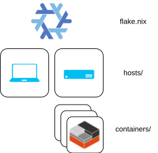

### [Flake](https://www.youtube.com/watch?v=JCeYq72Sko0) for managing personal [NixOS](https://nixos.org/) systems



### NixOS and Home Manager

I typically generate NixOS and home-manager config in the same step, and then upgrade into the latest with:

```fish
nrs
```

`nrs` is a fish function from `modules/home/fish/config.nix` that rebuilds the current host from this flake.

### Containers

LXC containers generated by this flake run in [Incus](https://linuxcontainers.org/incus/) on hosts also managed by this flake. Every `.nix` file in `containers/` is a buildable LXC image — the flake auto-discovers them.

Build, deploy, and relaunch with the scripts in `containers/`:

```fish
python3 containers/build.py --list          # List available containers
python3 containers/build.py spire           # Build one container
python3 containers/build.py                 # Build all containers
python3 containers/build.py --nightly       # Build only running instances
python3 containers/relaunch.py              # Relaunch containers with newer images
python3 containers/relaunch.py --dry-run    # Preview what would be relaunched
```

### Structure

```
.
├── containers/              # LXC image definitions; every direct *.nix is buildable
├── docs/                    # Reference docs for humans and agents
├── flake/                   # flake-parts output modules and discovery helpers
├── hosts/                   # NixOS host definitions and host-local facts
├── modules/                 # NixOS, Home Manager, Flatpak, and profile modules
├── pkgs/                    # Custom package outputs
├── devshells.nix            # Devshell declarations
├── flake.nix                # Inputs and flake-parts root
├── format.fish              # Format and lint entrypoint
└── README.md
```

See `docs/DENDRITIC.md` for the current flake structure and public output
contract.

### devshell

I'm increasingly making use of [devshells](https://github.com/numtide/devshell) to manage nixpkgs that activate on-demand. Basically an OS-level virtual environment.
Devshell activation is done via a [shell function](https://github.com/r6t/nixos-r6t/blob/bddac92b6da1879f021f0b3f7875e4dd65acefe0/modules/home/fish/default.nix#L55) to allow quick devshell activation without explicitly specifying my flake path:

- Default/Nix: `nd`
- Add name argument for other devshells. Ex: `nd aws`
